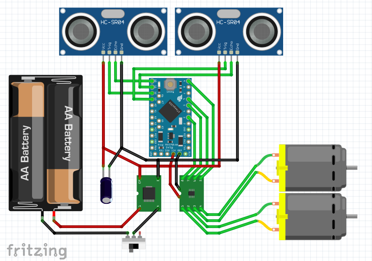

# Arduino Swiffer Bot

A small little car randomly swiffering your room. As described in other projects, I am not a professional programmer or have any education in electronics, so some own improvements may be in order.

##### YouTube:

#### Requirements:
* 1x Arduino Pro Mini ATMega 328p 5V
* 1x 1V-5V to 5V DC-DC Step-Up Power booster
* 1x HW-354 2way DC motor driver
* 2x HC-SR04 ultrasonic sensor
* 2x DIY Gear motor with wheel
* 1x Resistor 1kΩ
* 1x Toggle Switch
* 1x Battery case - 2slot AA
* Programming board for the Arduino Pro Mini *(*1)*
* Soldering equipment
* Wires
* Glue
* 3D printer
* Swiffer cloths

**1: There are several solutions, like using another arduino with an USB interface like the R3 or Nano, or use an interface like the CP2102 wich I preferred (don't forget to also order your dupont cables)*

#### Circuit:

